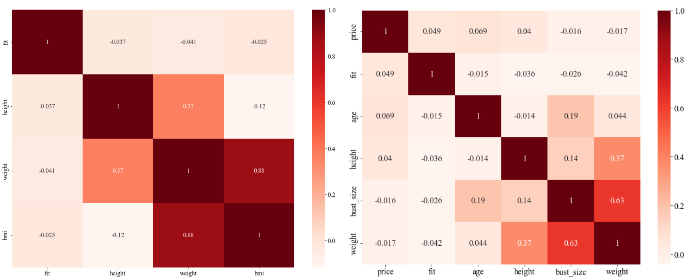
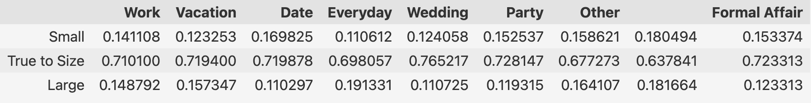
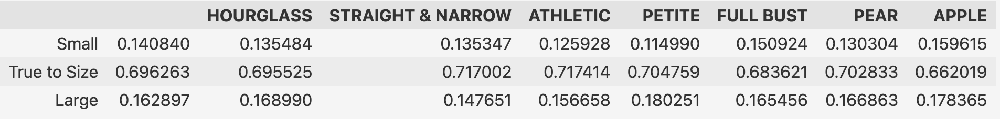

# Introduction to Machine Learning

Fall 2022  
University of Science and Technology of China

<!-- 
Yifei Zuo   PB20114514

Yunqin Zhu   PB20114514

Yongfan Lai   PB20114514
 -->

Project Report  
Lecturer: Jie Wang  
Due: Jan. 11, 2023

PB20114514, Yifei Zuo, 33%  
PB20061210, Yongfan Lai, 33%  
PB20061372, Yunqin Zhu, 33% 

  

## INTRODUCTION

Recommending clothes of suitable sizes to customers based on the information of clothes and users are very important for E-commerce platforms. In this project, we implement several classifiers to predict customers’ fit feedback based on a dataset collected from RentTheRunWay.

## PREPARATION

The training dataset contains 87766 samples, each of which has 14 features and 1 label. We summarize these records as follows:

(1) Item attributes, i.e. `item_name`, `size` and `price`; (2) User attributes. The first one is `user_name`, which is excluded in the test set. The others describe the body characteristics of each user: `age`, `height`, `weight`, `body_type` and `bust_size`; (3) Transaction attributes, i.e. `rented_for`, `usually_wear`; (4) Feedback, i.e. `fit`, `review_summary` `review` and `rating`, among which `fit` is the target variable we want to predict, and the other three are supposed to be inaccessible on the test set.

By observing that most of the inputs has missing values and inconsistent formats, we need to design a thorough data cleansing pipeline that converts the raw data into either categorical or numerical variables we can leverage for training. We also need to deal with the data imbalance issue, since the number of samples with `fit = True to Size`, consisting of 70% of the whole dataset, is much larger than the other two classes. These challenges are discussed in detail in the following sections.

### Data Cleansing

!!!!!!!! ZYQ

#### Numerical Features

#### Categorical Features

### Exploratory Data Analysis

#### Numerical Features

Base on the current transformation on data format, we measure the relationship among all features to further filter the dataset. First of all we look at numerical features. According to the literal meaning, features like `price` `age` are less likely to impact the `fit` feature, and by calculating their correlation index, we found that actually none of these numerical features are highly related to `fit`. We also analyze the possible combination of features, e.g `bmi` in the first figure below.

Base on the result from melting experiment upon models trained with and without numerical features, we decided to remove all numerical features in sparse matrix resulted from one-hot encoder (which we will talk about it later) due to the fact that these features are not likely to gain attention from the model, e.g. `PCA` will remove these columns in highest priority. And the model trained without these features outperform the model with these.

#### Categorical Features

Then we measure categorical features, note that we still keep the original `item_name` despite we have split it into `brand` and `category` cause we are not sure yet the performance of splitting. We first analysis the distribution of `fit` value inside each of these categories, e.g in `rented_for` and `body_type`. Meanwhile, we here keeps the empty values because sometimes empty values could be seen as a category and resulting more robust performance than imputing them.

We notice that except for `item_name` and its derivative column, the distribution inside each one do not have manifest difference, which implies that these features are still not the dominant one in terms of predicting `fit`. While `item_name` is too diverse and dirty for us to analyze in this way. So we measure the direct relationship of `fit` and all of these features by `chi2 test`. The result matches our expectation from previous observation, `item_name` is the key point and it is even more important than the features we extracted from it.

In this perspective, we keep `item_name` as the original and remove `brand`, `category`. 

### Handling Data Imbalance

In this project, we encounter the data imbalance problem, that is, if you just fill all the training data into your model, your model would probably learn to predict all the samples to be `True to Size`. Observing the orginal data, we find that they are unevenly distributed, where majority case accounts to more than 80% of all the samples. To address this problem, we come up with two alternative tactics:

#### Data Augmentation

This method bases on the common sense that if a cloth is small for one person, then it is likely to be small for persons whose bust size is larger. In this way, we randomly fetch data samples with `small` label, then duplicate it with bigger values in "weight", "height", "cup_size", "bust_size" column and vice versa. Moreover, during the experiment phase, we find that letting the number of `large` data slightly less than other two classes data can have the better performance than averaging three classes. Therefore, setting the upsampling ratio to 2.7 for `large` data and 3.6 for `small` data, we can get fairly augmented train data.

#### Random Split & Aggregation

It basically splitting the dominant class `True to Size` into `n` different group randomly, and concatenate them with `n` identical copy of the others, forming into `n` generated datasets. Then we feed them into `n` different workers which train and result in `n` models. We use each model to predict its own predictions and we sent them into Aggregator, who will give the final predictions by voting from the `n` workers’ predictions.

Noting that we don’t necessarily have to split the dominant class into `n` samples so that the number of samples in each group is approximately identical to the others. Due to the fact that this task is relatively hard and our model won’t give a tremendously impressing representation, we do need to fine tune the parameter `n`. A reasonable  assumption is that by relatively giving more samples in dominant class, we result will be better because there will be more samples fall into this class. Here’s some result of fine tuning:

## METHODOLOGY

### Overview

<figcaption>The architecture of our proposed model.</figcaption>

### Feature Learning

!!!!!!!! ZYQ

#### Leveraging Item Sizes

Denote the item, the user, and the parent item of a transaction $t$ by $i$, $u$, and $p$, respectively. We model the true size of the item $i$ as

$$
\mathbf{v}_i = \mathbf{v}_p + \epsilon_i\mathbf{d}_p,
$$

where $\mathbf{v}_p$ is the true size of the parent item, $\epsilon_i$ is the bias of item size relative to the parent item, and $\mathbf{d}_p$ represents the influence of size bias. We want to learn $\mathbf{v}_p$ and $\mathbf{d}_p$ for each parent item $p$. A simple approach for estimating $\mathbf{v}_p$ is to use the average of the true sizes of all users that have rent the parent item with $\epsilon_i = 0$. However, this approach is not accurate since the item can either be too small or too large for some users. To address this issue, we solve the following ordinal regression problem to learn $\mathbf{v}_p$ and $\mathbf{d}_p$:

$$
\begin{aligned}
\min_{\mathbf{w}, b_1, b_2, \mathbf{v}_p, \mathbf{d}_p} & \sum_{t\in \mathcal{T}} \ell(y_t, f(\mathbf{w}, \mathbf{v}_i), b_1, b_2),\\
\text{s.t.} \quad & \mathbf{w} \ge \mathbf{0},\ \mathbf{d}_p \ge \mathbf{0},
\end{aligned}
\tag{1}
$$

where we define $f(\mathbf{w}, \mathbf{v}_i) = \mathbf{w}^\top(\mathbf{v}_i - \mathbf{v}_u)$ as the fitness score between the item and the user, and $\ell(y_t, f(\mathbf{w}, \mathbf{v}_i), b_1, b_2)$ is the total loss of 2 binary logistic classifiers:

$$
\ell(y_t, f(\mathbf{w}, \mathbf{v}_i), b_1, b_2) =
\begin{cases}
\log (1+e^{f(\mathbf{w}, \mathbf{v}_i)-b_1}), & \text{if}\ \ y_t = \mathtt{small};\\
\log (1+e^{-f(\mathbf{w}, \mathbf{v}_i)+b_1}) + \log (1+e^{f(\mathbf{w}, \mathbf{v}_i)-b_2}), & \text{if}\ \ y_t = \mathtt{true2size};\\
\log (1+e^{-f(\mathbf{w}, \mathbf{v}_i)+b_2}), & \text{if}\ \ y_t = \mathtt{large}.
\end{cases}
$$

Note that, in Prob. (1), we add the constraint $\mathbf{d}_p \ge \mathbf{0}$  to capture the monotonicity of the true size $\mathbf{v}_i$ with respect to the size bias $\epsilon_i$, and also $\mathbf{w} \ge \mathbf{0}$ to ensure the monotonicity of the predicted fitness scores with respect to the item size.

#### Detecting User Prototypes

### Fit Feedback Classification

In preceding part, we already have a penetrating insight of our tasks. As for the final models, considering the model performance and the implementing difficulties, we choose the Logistic Regression model to implement.

#### Multinomial Logistic Regression

At first, we implemented the classifier with gradient descent algorithm. However, its performance not so good as the model from sklearn library. So we imitate the sklearn implementation, using BFGS method in scipy.optimize to minimize the multiclass logistic regression function, and get another form of the classifier. 

#### Ordinal Logistic Regression

Besides, notice that the values of fit have ordinal meanings, we also try the ordinal regression. Here we adapt a classic way to implement our ordinal regression classifier, which is constructed by two binary logistic regression model. For binary classifier A, we want it to learn $P(fit > Small)$ i.e. $P(y > 0)$. Similarly, let B to learn $P(fit > True\ to\ Size)$, i.e. $P(y > 1)$. We can acheive this by re-mapping the label into {Small:0, True to Size:1, Large:1} and {Small:0, True to Size:0, Large:1} while training classifier A and B respectively. Finally, we can get the desired probability by:

$$
\begin{aligned}
&P(y = 0) = 1 - P(y > 0)\\
&P(y = 1) = P(y > 1) - P(y > 0)\\
&P(y = 2) = P(y > 1)
\end{aligned}
$$

### Predicting Missing Labels

This section contains methods we hasn’t fully implemented from scratch due to the limit of time, but we think it’s valuable to present it here in the report. 

Our target it to leverage pre-trained model on Transformer and fill in the sample’s empty `fit` value. This approach is promising because `rating` `review` and `review_summary` are not taken advantage of in our training yet. And the relationship of `fit` and these columns, especially `review` and `review` summary, are great. However these records are highly textual and language models based on Transformer are doing well in these circumstances while pre-trained models could dramatically reduce training expenses. 

#### Biderectional Encoder Representation from Transformers (BERT)

Some basic description of BERT here. (If time permits)

#### Implementation Details

You might ask even if we already implement a Transformer from scratch, how can we load a pre-trained language model into our class object? The signature of class and function definition won’t match! Well the point is there’s bug inside `pickle` function which `torch.load()` make use of. By some hacking techniques like code injection we could eventually load the object into our own designed class object. 

We basically convert the format into series of sentences containing both header of column and content in the cell, separated by special token. The we feed them into a language model (we use `roberta-base`) and trained the model. The performance of the model increases from `69%` of filling `f1_score` to `84%`. 

It's a good result but not satisfying out expectation. We then perform a `delta-tuning` trick onto the model and improve the result into `94%` if filling `f1_score`.  The tuning model is basically the trained encoder plus an additional randomly initialized `MLP`. When training the tuned model we need to freeze the encoder and only update the weight in the `MLP` layers. 

By filling the empty `fit` value, we trained our models on filled dataset and each model get a fairly better result. However, as mentioned above, we haven’t implement it using `white list` lib only, so we didn’t use the method in our submission model (though there’s a file named `bert.py`, we didn't import it in our main file). 

## EXPERIMENTS

### Experimental Setup

### Results and Analysis

## CONCLUSION
